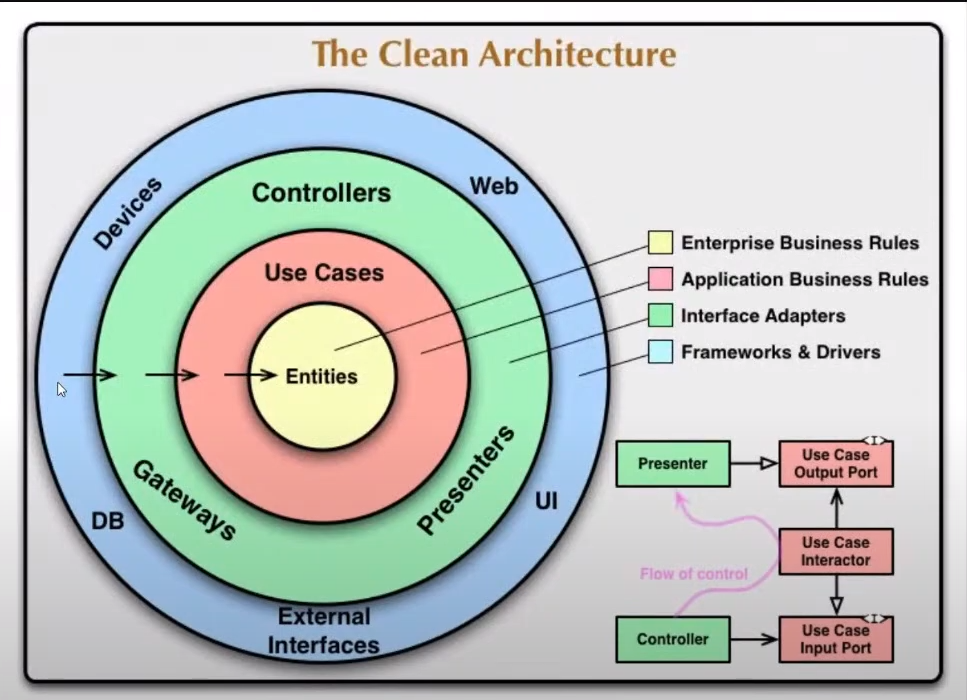

```
npm i -D typescript
npx tsc --init
```

# Las reglas de negocio son independiente del framework, base de datos, del ORM



// anemicos - ORM, JPA, Hibernate,
Eloquent

los modelos no dependen del framework y son ricos

# PORTS

es la puerta de entrada para interactuar con la capa de aplicacion
estan en la capa de dominio

# Adapters

estan en la infra y son adaptadores e interactuan con la base de datos por ejemplo
o mandan una notificacion siendo que puedo cambiarlos en cualquier momento e implementar
otro proveedor
