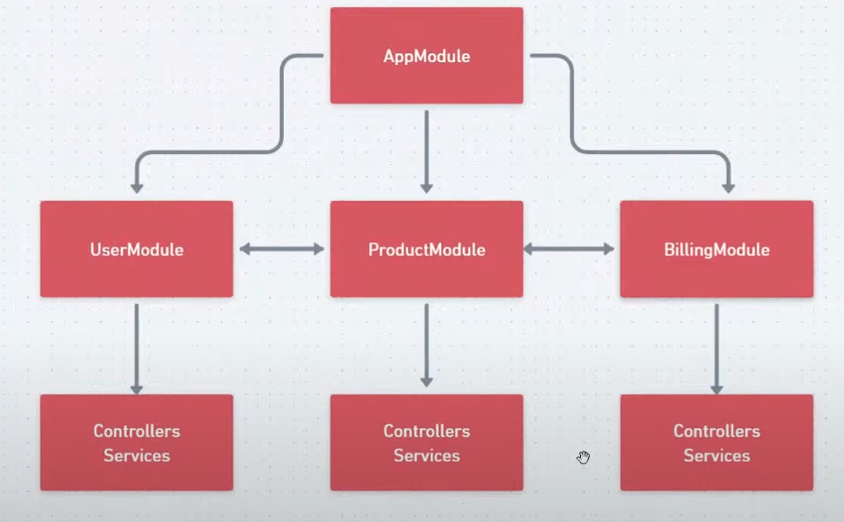

## Existe 2 tipos de orm

- Active Record: Sequelize, Prisma, Eloquent, TypeORM, Mickro, Doctrine, Hibernate, Mongoose
- Data Mapper: TypeORM (hibrido)

## Application

coordina las reglas de negocio de mi aplicacion que precisan ser ejecutadas
consolidando orquestando, organizando las reglas de negocio para atender las necesidades del usuario

el controller no sabe ni que existe las entidades ni debe saber

Prisma problemas

- switch de vendors (dbs) dev test prod
- mas lento que otros orm
